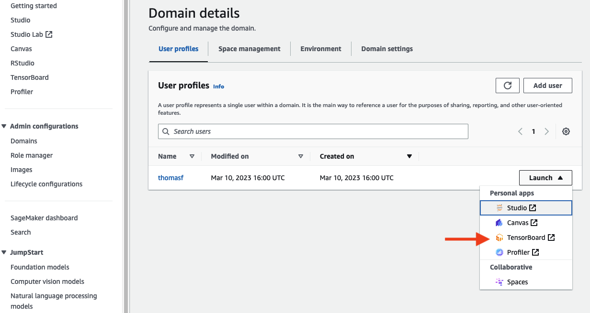

# LLNL Machine Learning Library
This repository contains code and notebooks for training semantic segmentation models on LLNL's layered fabrication datasets.

The repository is broken into two main directories 1) `notebooks` and 2) `llnl_ml`. First, `notebooks` contains Jupyter
notebooks for launching training jobs, performing qualitative model evaluation and launching batch jobs. The `llnl_ml` folder
contains all required model training code including the model definitions, data loaders, and training loop.

This readme is broken into 3 primary sections: [Model Training](#model-training), [Model Evaluation](#model-evaluation),
and [Batch Inference](#batch-inference). Refer to each section for details on each step of the modelling process.

## Model Training

The training code utilizes the following:

* Python 3.10
* [PyTorch](https://pytorch.org/docs/stable/index.html) >= 2.0.1
* [TorchVision](https://pytorch.org/vision/stable/index.html) >= 0.15
* [PyTorch Lightning](https://lightning.ai/docs/pytorch/stable/)
* [TorchMetrics](https://lightning.ai/docs/torchmetrics/stable/)

### Launch Training Job
Use the [LaunchTrainingJob.ipynb](notebooks/LaunchTrainingJob.ipynb) to launch a SageMaker Training job.
This notebook will launch a segmentation training job on the desired instance type and data paths.
When running a job, make sure to set the following parameters within the Notebook:

**General Parameters**
* **train_image**: [S3 uri](https://repost.aws/questions/QUFXlwQxxJQQyg9PMn2b6nTg/what-is-s3-uri-in-simple-storage-service) path where the raw images are stored.
* **train_mask**: S3 uri where the mask images are stored
* **experiment_name**: This will be used to 1) name the training job and 2) used to aggregate jobs via SageMaker Experiments.

**Hyperparameters**
* **model_name**: Update to the model you want to train. See [Supported Models](#supported-models) below for list of supported model names.
* **epochs**: Number of epochs (times models sees entire dataset) to train for.
* **batch_size**: Adjust based on the model and instance type being used.
Note, this is a per GPU/Accelerator count and will scale up/down for each available GPU automatically.
Reference, on a p3.*xlarge used 6 for `UNet` and 20 for `MaskRCNN` during testing.
* **learning_rate**: Adjust up/down based on total batch size (`batch_size` * number of GPUs). Some [rules of thumb](#learning-rate-rule-of-thumb).
* **image_mode**: Options are `grayscale` or `RGB`. UNets work with both, MaskRCNN only works with `RGB`.

**Estimator Parameters**
* **instance_type**: Type of machine instance to use. Currently, supports p3, p4, and g5 family of instances.
* **input_mode**: Options are `File` and `FastFile`. For details on input mode types, see [documentation](https://docs.aws.amazon.com/sagemaker/latest/dg/model-access-training-data.html)

#### Learning Rate rule of thumb
Setting the correct learning rate is vital for proper model training performance.
Too high and the model may collapse, too low, and it may never converge or get trapped in suboptimal solution.
To help smooth this problem out, we recommend using a Cosine Learning Rate with Warmup learning rate schedule.
For the first `k` epochs, the learning rate starts very low and linearly scales to the `learning_rate` value you set in the hyperparamters.
For the remaining epochs, the learning scales down to 0 following a cosine curve.
Originally introduced in [SGDR: Stochastic Gradient Descent with Warm Restarts](https://arxiv.org/abs/1608.03983) and additional information can be found [Bag of Tricks for Image Classification with Convolutional Neural Networks](https://arxiv.org/pdf/1812.01187.pdf)

In addition to the schedule, we recommend scaling the maximum learning rate based on the total batch size.
In general, as the batch size increases, the maximum learning rate increases and vice-versa.
A larger batch size typically means more information and less variance of error within the data.
This enables the model to take larger "steps" (determined by learning rate) with less chance of the model collapsing.

If unsure of the optimal learning rate, it is recommended to use a smaller, more conservative value and allow the
model to train for additional epochs.


### Supported Models
The `llnl-ml` code base currently supports the training and deployment of the following model architectures.
These are the model names used by the [model builder code](src/llnl_ml/model/builder.py)

* **UNet** - Reference UNet model that utilizes 5 down and up sample layers
* **UNetSmall** - Small version of UNet utilizing 2 down and up layers
* **UNetMedium** - Medium versino of UNet utilizing 3 down and up layers
* **FCN** - Reference FCN architecture utilizing 2 down and up layers
* **MaskRCNN** - Wrapper around TorchVisions MaskRCNN  implementation. By default, uses a ResNet50 backbone with ImageNet pretrained weights.

#### Adding new models
New model architectures can be added to this repository.
We recommend creating a new python file within the models directory for each new architecture.

The new model will need to work with the following 2 pieces of code:
1. The `get_model` function in the [builder module](src/llnl_ml/model/builder.py)
2. The `SegmentationLightningModule` in the [lightning module](src/llnl_ml/lightning.py)

There are 3 steps to adding a new model:

#### 1. Create Module Wrapper
We recommend creating a wrapper `Torch.nn.Module` class around the new model being imported if coming from a library.
The wrapper will ensure the new model 1) matches the expected inputs/outputs of the forward pass and 2) provides
property values for determine the input data format and output from the training forward passes.
See [mask_rcnn.py](src/llnl_ml/model/mask_rcnn.py) for an example of wrapping an existing model from the TorchVision library.

Model wrappers will ensure the model meets the following criteria:

**Training Forward Pass**

The training forward pass needs to accept one of the two data formats created by the [Dataset Loader](src/llnl_ml/data.py)
(see below for details) and return either a tensor of shape `[N, 1, H, W]` containing the logit mask predictions (note, no sigmoid function) or
a dictionary of losses. The forward pass will implement the following:

```python
def forward(self, images, targets: Optional[dict] = None) -> Union[torch.Tensor, dict]:
    ...
```

The wrapper must implement the following `property` to let the code know whether the model is computing losses or returning masks:

```python
@property
def calculate_loss(self):
    """
    Set to True if the Training Forward pass takes in both the images and targets and returns a dictionary of losses
    Set to False if the Training Forward pass only takes in images and returns predicted masks
    """
    return True/False
```

See [UNet](src/llnl_ml/model/unet.py) for example of model that takes in only images and returns mask logits.

See [Mask-RCNN](src/llnl_ml/model/mask_rcnn.py) for example of model that takes both images and targets and returns losses.

**Dataset Output Types**

The dataset loaders returned by [get_data_loaders](src/llnl_ml/data.py) supports two data formats for images and targets.
The model wrapper will need to support 1 of these two styles.

The wrapper implements the `needs_boxes()` property. This value is used internally to determine which style of images/targets
the data loader will return.

```python
@property
def needs_boxes(self):
    """
    If False, dataset loader returns images and masks as single tensors following option 1 below
    If True, dataset loader returns images and masks as lists following option 2 below
    """
    return True/False

```

**1. Single Tensors for images and Masks**

Images are returned as a single Tensor of shape `[N, C, H, W]` where `N` is batch_size. Masks are returned as a single
dictionary with the key `masks` that contains a tensor of shape `[N, 1, H, W]`.

This is the style used by `UNet` and `FCN` model architectures.

**2. List of Tensors and Targets**

More complex segmentation models often train with multiple target styles including bounding boxes and masks. As each image
will contain a different number of bounding boxes (one per connected component), images and targets are batched as python
lists rather than a single tensor:

```
images = [image1, image2, image3, ...]
imageN.shape = [1, C, H, W]
```

Each target dict also contains additional keys with different shapes:

```
target = {
    "boxes": tensor.shape = [K, 4] of format [x1, y1, x2, y2]
    "labels": tensor.shape = [K,]
    "masks": tensor.shape = [K, H, W]
}
```
where `K` is the number of connected components (or independent masks) within the image. The dataset object handles the
conversion from segmentation mask to this dict structure.

This is the data format used by `Mask-RCNN` model. Note, this model takes both the images and targets as part of its
foward pass and returns a dictionary of losses for each loss type computed.

**Inference/Evaluation Forward Pass**

The inference forward pass (when model is set to eval mode `model.eval()`) will only take the batched input images and
return a single mask prediction tensor of shape `[N, 1, H, W]`.

#### 2. Update `get_model`
To use the model, update the `get_model` factory to return your new model.

In [model/builder.py](src/llnl_ml/model/builder.py):

1. Import your model wrapper into the file `from llnl_ml.model.your_model import ModelWrapperName`
2. Add your model name to the `MODEL_NAMES` dict:
```python
MODEL_NAMES = {
    # ...
    "ModelName": ModelWrapperName,
}
```

### Viewing Tensorboard via SageMaker Studio

Full documentation of viewing and using Tensorboard within SageMaker Studio can be found at:

https://docs.aws.amazon.com/sagemaker/latest/dg/tensorboard-on-sagemaker.html

We recommend opening a Tensorboard Instance via the console within the SageMaker Studio domains panel as seen in the
image below.




Alternatively, if Tensorboard is not available within your region. The tensorboard logs can be downloaded from
S3 locally and a local tensorboard server can be run. Location of tensorboard logs is in the [LaunchTrainingJob](notebooks/LaunchTrainingJob.ipynb)
notebook and defined when creating the `tensorboard_output_config` object:

```python
tensorboard_output_config = TensorBoardOutputConfig(
    s3_output_path=os.path.join(f"s3://{bucket}", 'tensorboard_logs', job_id, "tensorboard"), # Log Location S3 Uri
    container_local_output_path="/opt/ml/output/tensorboard"
)
```

### Trainium (ml.trn1) Instance Support
We are currently still working on supporting Trainium instance types within this codebase.
Will update this section when support is available.


## Model Evaluation

Qualitative model evaluation can be performed using the included [ModelEval](notebooks/ModelEval.ipynb) notebook.
To utilize the notebook, test images and masks need to be stored locally and the desired model weights will also need
to be downloaded.


## Batch Inference

Once the model is trained, find the name of the trained job and use the [LaunchBatchJob](notebooks/LaunchBatchJob.ipynb)
notebook to start a training job.

## Pre-commit Hooks
This directory has [pre-commit](https://pre-commit.com/) hooks enabled. Pre-commit runs a number of standard formatting
and code checks on the code being submitted for a git commit. This code base utilizes the following hooks:
* [black](https://github.com/psf/black) - Python code formatter
* [flake8](https://github.com/PyCQA/flake8) - Flake8 linter
* [check-json](https://github.com/pre-commit/pre-commit-hooks) - Ensure proper formatting of json encoded files
* [trailing-whitespace](https://github.com/pre-commit/pre-commit-hooks) - Removes extra spaces at end of lines
* [bandit](https://github.com/PyCQA/bandit) - Python static code security analysis
* [nbstripout](https://github.com/kynan/nbstripout) - Removes output from Jupyter notebooks (ensures random output from runs is not checked in)


**WARNING**: Nbstripout will modify your working copy notebooks! It is highly recommend to create a copy of the checked in notebook
when performing work to ensure any important outputs are not lost.

### To Use
Install the `pre-commit` python package into your python virtual environment.
We do not include this in the requirements.txt file as it is only required for development and not a requirement of the code.
We highly recommend using a virtual environment or a conda based environment for each project.

```shell
$ cd <repository_root>
$ source /env/bin/activate # activate the repo's virtual environment
# Alternatively, activate the repo's conda environment
$ pip install pre-commit
# Set up the git hooks for this repository
$ pre-commit install
```

To create a virtual environment:

```shell
$ cd <repository_root>
$ python3.10 -m virtualenv env  # Use the specific version of python you want to use when calling
```

After pre-commit is installed, all checks will be run automatically whenever git commit is performed.
`pre-commit run` will manually run all checks, while each component can be run separately, e.g. `pre-commit run flake8` or `pre-commit run black`
To disable pre-commit checks permanently, run `pre-commit uninstall`, or to disable for a single commit, use `git commit -m '{commit msg}' --no-verify`

If a pre-commit hook fails (e.g. black updates the file), the commit will fail.
Fix the errors (e.g., Flake8 error), re-add the updated files and commit again.

Occasionally, Flake8 and Black will conflict with each other. Pick the one you agree with most and disable the other
via comments in the code.